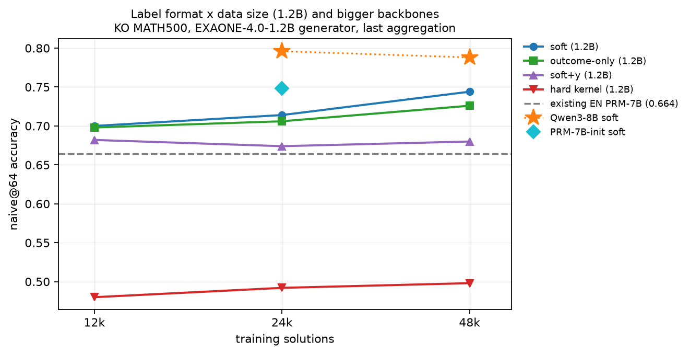
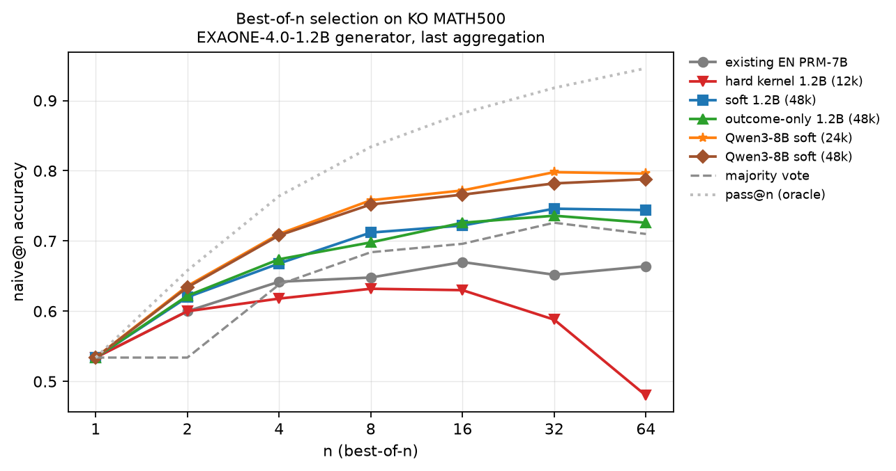
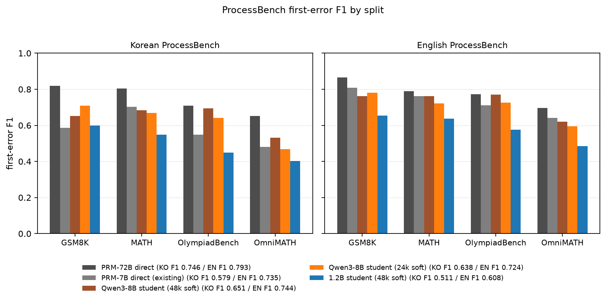

# 한국어 PRM 라벨 투영 — 최종 결과 보고서

작성일 2026-09-23, 보강 2026-09-26(§3.8~3.10, 새 생성 없이 저장된 점수를 다시 읽은 분석). 실험 기간 2026-09-20 ~ 2026-09-23, 서버는 RTX A6000 48GB 8장. 설계 문서는 `Plan.md`(§15에 라운드별 판정), 모든 표의 원본은 `data/reports/results.md`, 재현 절차는 `HANDOFF.md`에 있다. 이 문서는 동기부터 결론까지를 한 번에 읽을 수 있게 정리한 것이고, 수치는 위 문서들과 같다.

## 요약

- **질문.** 영어 수학 PRM(Qwen2.5-Math-PRM-72B)의 판정을 번역 다리로 빌려 오는 것만으로, 사람 라벨이나 한국어 판정 모델 없이 한국어 PRM을 만들 수 있는가.
- **답.** 있다. 다리 자체는 거의 손실이 없고(감사 세트 정밀도 차이 0.5%p), 병목은 라벨 형식과 학생 크기였다. 교사 확률을 그대로 소프트 타깃으로 쓰고 학생을 Qwen3-8B로 키우면, 한국어 풀이 2.4만 개로 학습한 학생이 KO MATH500 Best-of-64에서 현행(영어 PRM 7B를 한국어에 직접 적용) 0.664를 0.796으로 올린다. 이 학생은 n=16에서 번역 다리를 건넌 72B 교사(0.762)보다도 높다(0.772).
- **부수 결과.** 같은 학생이 손대지 않고 영어 MATH500으로 나가도 영어 PRM 7B를 넘고(0.842 대 0.830), 한국어 ProcessBench F1도 7B 직접(0.579)을 넘는다(0.651). 스텝 단위 판정의 천장은 아직 72B 직접(0.746)이다. 학생은 BoN을 목표로 학습했고 ProcessBench의 첫 오류 식별은 훈련 목표가 아니므로, 스텝 판정에서 기존 PRM을 확실히 앞선다고 주장하지 않는다.
- **PRM 기반 적응형 할당.** 풀이를 하나씩 뽑다가 가장 높은 PRM 점수가 τ를 넘으면 멈추는 규칙이 8B 학생에서 진짜 할당 신호다. 같은 평균 풀이 수에서 PRM 없는 합의율 멈춤보다(EXAONE +1.5%p, Qwen-3B +4.4%p, Qwen-1.5B +6.7%p, 16개 예산) 그리고 고정 N보다 유의하게 높고, 고정 64개와 1%p 안에 드는 데 평균 14~21개면 된다(고정 N은 27~39개). 예산은 어려운 문제로 간다(레벨 1 약 7개, 레벨 5 약 22~28개). 현행 영어 PRM의 점수로는 같은 규칙이 고정 N을 넘지 못한다(§3.10).
- **기각된 것.** 사전 등록한 하드 커널 라벨은 데이터를 4배로 늘려도, 집계를 바꿔도, 백본을 키워도 회복되지 않았다. 학습 곡선은 1.2B에서 1.2만 지점에서 이미 평평했고, 사람 라벨(PRM800K 번역, A 팔)은 어떤 지표에서도 자동 라벨(B 팔)보다 낫지 않았다. 8B에서는 2.4만→4.8만의 데이터 확장이 포화했다.
- **남은 격차.** 어려운 분할(omnimath)의 스텝 판정. 절반은 교사에게서 물려받은 것이고 절반은 학습 범위를 넘는 조밀한 계산 스텝에서 학생이 내는 오탐이다.

## 1. 동기

### 1.1 문제

과정 보상 모델(PRM)은 풀이의 스텝마다 "여기까지는 맞는가"를 채점해, 여러 후보 중 답을 고르는 Best-of-N(BoN)과 탐색을 이끈다. 공개된 강한 PRM은 영어로 학습되어 있고, 한국어 풀이에는 그 모델을 그대로 얹어 쓰는 것이 현행이다. 이 현행이 얼마나 잃는지는 이번 실험에서 직접 쟀다. Qwen2.5-Math-PRM-7B는 영어 ProcessBench 표본에서 F1 0.735인데 같은 문제·풀이의 한국어 번역본에서는 0.579로 떨어지고(오류 위치 정확도 0.629 → 0.417), KO MATH500 BoN에서는 다수결(0.710)보다도 낮은 0.664를 낸다.

한국어 PRM을 새로 만드는 길은 둘이다. 사람이 스텝 라벨을 붙이거나(PRM800K 방식, 비싸다), 완성 모델의 몬테카를로 롤아웃으로 라벨을 추정하거나(Math-Shepherd 방식, 완성기 능력에 묶인다). 둘 다 대상 언어에서 다시 해야 한다.

### 1.2 주장

이 프로젝트의 주장은 하나다. **단일언어 PRM을 새 언어로 넓히는 데 필요한 것은 번역기와 원래 PRM뿐이다.** 한국어 생성기의 풀이를 스텝 단위로 영어로 번역해 72B 교사에게 채점받고, 언어와 무관하게 공짜로 얻는 최종 정오 y로 그 판정을 굳혀 라벨을 만든다. 사람 라벨도, 대상 언어의 판정 모델도 새로 만들지 않는다.

### 1.3 사전 등록한 증거의 형태

절대 성능이 아니라 상대 비교로 증거를 두었다(Plan §1). 학습 텍스트와 라벨 출처가 다른 세 팔을 같은 크기로 비교한다.

| 팔 | 학습 텍스트 | 라벨 출처 |
|---|---|---|
| A | PRM800K 풀이를 영→한 번역 | 사람 라벨 그대로 (기존 다국어 PRM 연구의 방식) |
| B | 한국어 생성기의 온폴리시 원문 | 한→영 번역 → 72B 교사 채점 → y 조건부 커널 |
| A+B | 둘을 반씩 | 위와 같음 |

1. 같은 크기에서 B ≥ A이고, A+B가 둘 이상이다.
2. 3천 → 6천 → 1.2만 풀이의 학습 곡선이 1.2만에서 아직 오르고 있다.
3. 현행(영어 PRM 직접)과 번역 경유 교사는 참조선으로 그리되 통과 기준으로 쓰지 않는다.

1.2B 학생을 1.2만 풀이로 처음부터 학습해 현행을 넘기는 것은 기대하지 않았다. 공개 PRM들은 수십만 풀이로 학습된다.

## 2. 방법

### 2.1 데이터 파이프라인

**분할.** MATH train에서 레벨 층화로 dev 500문제를 먼저 뗐고, 나머지 MATH 7,000 + GSM8K 7,473 = 14,473문제가 train 풀이다. 테스트는 KO MATH500이며 dev·train 풀과 겹치지 않는다. PRM800K는 학습용 A 풀(65,964풀이, 9,668문제)과 감사용 held-out(오답 500 + 정답 500)으로 나눴고 이들도 dev·MATH500과 겹치지 않는다.

**생성과 선택 (B 팔).** 문제를 영→한으로 번역한 뒤 EXAONE-4.0-1.2B와 Qwen2.5-3B-Instruct로 문제당 생성기별 2풀이를 T=0.8로 만들고(train 풀 정답률 0.538 / 0.465), math_verify로 y를 붙였다. 정답과 오답이 같이 나온 문제만 남기고(7,232문제) 문제당 정답 1·오답 1을 생성기 균형으로 뽑아 6,000문제 12,000풀이를 만들었다(MATH 3,450 + GSM8K 2,550). 풀이 생성기를 작은 모델로 둔 이유는, PRM이 평가 때 채점하는 것이 바로 이 크기 생성기의 한국어 풀이이기 때문이다.

확장 단계에서는 같은 문제에 생성기당 6표본을 더 만들어(새 풀이 173,100개) 문제당 클래스별 최대 4개까지 뽑았다. 섞인 문제 11,153개에서 77,855풀이가 나왔고 48,644풀이에 라벨을 붙여 12k ⊂ 24k ⊂ 48k 중첩 세트를 만들었다.

**번역 다리.** 번역기는 gemma-4-12B-it 하나다(폴백 없음). `$...$`, `\boxed{}`, 독립 숫자를 자리표시자 `⟦M1⟧`로 마스킹하고 스텝을 하나씩 문맥 없이 번역한 뒤 복원한다. 자리표시자가 누락·중복되면 그 풀이를 버린다. 스텝 분절은 한국어 쪽에서 빈 줄로 정하므로 한·영 스텝 대응은 구성상 1:1이다. GSM8K 문제의 18%가 통화 `$`를 수식으로 오인하던 것을 내용 기반 판정으로 고쳤다(수정 전 산문을 삼키는 문제가 GSM8K 1,335개, 수정 후 3개).

**교사 채점.** Qwen2.5-Math-PRM-72B를 vLLM 풀링 러너(bf16, TP=4)로 돌려 `<extra_0>` 위치의 2-class 로짓을 float32 로그 오즈 z_t로 캐시한다. 7B로 HF 참조와 대조해 스텝 수가 일치하고 |Δz| ≤ 0.2임을 확인했다.

**커널 라벨 (하드).** 스텝 라벨은 "이 접두가 아직 정답에 닿을 수 있는가"이며 Math-Shepherd의 하드 추정과 같은 정의다. y=1 풀이는 전 스텝 1이다. y=0 풀이는 마지막 스텝이 0이고, 그 앞은 교사 점수의 하강폭을 정답 풀이에서 만든 기준 분포 D_g(생성기별)와 비교해 첫 오류 후보를 세우고, 첫 오류가 후보 k라는 가설들의 가중 r_lo/r_hi가 0.9 이상이면 1, 0.1 이하이면 0, 그 사이는 마스크로 둔다(Plan §2.4). 절대 임계를 쓰지 않는 이유는 번역 어투나 생성기 문체 때문에 교사가 풀이 전체에 낮은 점수를 주는 경우가 있기 때문이다.

**A 팔.** PRM800K phase 2의 전체 풀이 12,000개(정답 6,000 / 오답 6,000)를 영→한으로 번역하고 사람 라벨을 같은 형식(첫 −1 앞은 1, 그 뒤는 0)으로 맞췄다.

**감사 세트.** PRM800K held-out 1,000풀이를 영→한→영으로 왕복시켜 B와 똑같은 절차에 태우고, 사람의 첫 오류 위치와 대조해 라벨 정밀도·커버리지·다리 비용(영어 원문에 교사를 직접 태웠을 때와의 정밀도 차이)을 잰다. §9의 관문은 0.9/0.1 임계에서 정밀도 90%다.

### 2.2 라벨 형식

학습 세트의 스키마는 같고 손실도 하나다. 라벨 형식은 학습 플래그 하나로 고른다.

```
L = CE(y, p_T) + (1/|M|) · Σ_{t∈M} CE(ℓ_t, p_t)     M = 마스크되지 않은 스텝(마지막 제외)
```

| 형식 | 스텝 목표 ℓ_t | 비고 |
|---|---|---|
| 하드(커널) | 커널의 1/0, 마스크 제외 | 사전 등록한 기본 형식. A 팔은 사람 라벨의 1/0 |
| 소프트 | σ(z_t), 전 스텝 | 교사 확률을 그대로 목표로 쓴다 |
| 소프트+y | σ(z_t), 단 y=1 풀이는 전부 1.0 | 정답 풀이의 접두는 증명된 1이라는 §2.1 논리 |
| 결과 항만 | 스텝 항 없음 | 결과 보상 모델(ORM)과 같다 |

**훈련 목표는 ProcessBench와 다르다.** 이 학생은 한국어 풀이 가운데 정답을 고르는 것(BoN)을 목표로 학습한다. 마지막 스텝 점수는 결과 항 CE(y, p_T)로 math_verify가 확인한 실제 정답 여부를 직접 배우고, 중간 스텝은 번역 다리를 건넌 72B의 확률을 따라간다(소프트). 학습 문제와 풀이는 평가와 같은 MATH·GSM8K 수준의 한국어 풀이다. ProcessBench가 재는 능력, 곧 사람이 라벨한 첫 오류를 절대 임계 0.5로 짚는 능력은 직접 최적화하지 않는다. 비교 대상인 Qwen2.5-Math-PRM은 바로 그 스텝 정오를 목표로 학습한 모델이므로, ProcessBench는 이 학생에게 훈련 목표 밖의 지표다(§4.6).

### 2.3 학생과 학습

학생 구조는 Qwen2.5-Math-PRM과 같다. 백본은 수정 없는 인과 LM, 스텝 끝 구분 토큰 위치에 `Linear-ReLU-Linear(2)` 헤드를 얹고 그 위치의 2-class CE로 학습한다. 백본은 네 가지를 썼다.

| 백본 | 크기 | 학습 방식 | 비고 |
|---|---|---|---|
| EXAONE-4.0-1.2B | 1.2B | 1 GPU, 전체 미세조정 | 주 학생. 구분 토큰 `[unused0]` |
| Qwen2.5-3B-Instruct | 3B | 1 GPU, 그래디언트 체크포인팅 | 백본 비교용 |
| Qwen2.5-Math-PRM-7B 초기화 | 7B | 4 GPU FSDP2 | 영어 PRM의 백본과 헤드에서 출발 |
| Qwen3-8B | 8B | 4 GPU FSDP2 / 8 GPU HSDP 2×4 | 헤드는 새로 만듦 |

초매개변수는 전 실행에 같다. lr 1e-5, 워밍업 3%, 코사인, 풀이 64개 배치, 최대 길이 2048, bf16, 3에폭. 에폭은 dev 500문제 × 16샘플의 (naive@16 + weighted@16)/2가 가장 큰 것을 고른다. 다만 PRM-7B 초기화 학생은 그 PRM이 MATH train으로 학습되어 dev가 오염되어 있으므로(dev naive@16 0.75 대 1.2B 0.64) 3에폭을 미리 선언하고 세 에폭을 모두 보고했다.

### 2.4 평가

- **KO MATH500 BoN.** komath 하네스가 저장해 둔 생성기 3종(EXAONE-4.0-1.2B, Qwen2.5-3B-Instruct, 홀드아웃 Qwen2.5-1.5B-Instruct)의 64샘플을 학생으로 다시 채점한다. 재구현한 집계가 komath 결과를 1.4%p 이내로 재현한다. 풀이 점수는 라벨의 누적 의미에 맞춰 마지막 스텝(last)을 기본으로 하고 min·prod·mean을 보조로 낸다. n=16과 n=64의 naive/weighted/majority를 보고하고, 채점기 사이 차이는 문제 단위 대응 부트스트랩(1,000회) 95% 구간으로 낸다. 주 생성기는 학생과 크기가 같은 EXAONE이다.
- **참조선.** 현행(영어 PRM 7B를 한국어 원문에 직접)과 번역 경유 교사(EXAONE 16샘플을 한→영 번역해 72B로 채점, min).
- **영어 MATH500.** 같은 두 생성기로 영어 풀이 64개씩을 새로 만들고, 한국어로 학습한 학생을 고치지 않고 얹었다. 참조선은 영어 PRM 7B 직접.
- **한국어 AIME 2023/2024.** 60문제 중 56문제를 번역해 생성기당 64샘플. 나중에 Qwen3-4B·Qwen3-8B 생성기를 추가했다.
- **ProcessBench.** 분할마다 200행을 뽑아 문제와 스텝을 영→한 번역해 761행(gsm8k 199, math 193, olympiadbench 182, omnimath 187)을 만들고, 영어 원문과 한국어 번역본 양쪽에서 잰다. 첫 오류 예측은 P(정상) < 0.5인 첫 스텝, F1은 오류 풀이의 위치 정확도(err_acc)와 정답 풀이를 지적하지 않는 비율(corr_acc)의 조화평균이다. 7B PRM의 공개 ProcessBench F1(약 73.5)이 이 영어 표본에서 0.735로 재현되므로 표본은 믿을 만하다. 학생에게는 훈련 목표 밖의 지표이며(§2.2), 스텝 판정이 어디까지 따라오는지를 보는 보조 지표로 쓴다.
- **첫 오류 감사.** 감사 세트의 y=0 풀이 481개(영어 문제 + 한국어 스텝)에서 학생 예측과 사람 라벨의 일치율.

### 2.5 실행 규모

| 항목 | 규모 | 소요 |
|---|---|---|
| 문제 번역 영→한 | 14,973문제 | 1 GPU 약 30분 |
| 생성 | train 풀 5.8만 + dev 1.6만 + 확장 17.3만 풀이 | GPU 분할 |
| 스텝 번역 | B 1.2만 + 확장 3.8만 + A 1.4만 + 감사 왕복 + 참조선 8천 + 분포 이동 | |
| 교사 72B 채점 | B 4.9만 + 감사 2천 + 참조선 8천 + ProcessBench | TP=4 인스턴스당 약 1.6풀이/초 |
| 학습 1.2B | 3k 21분, 12k 85분, 48k 5.5시간 (1 GPU) | 총 27회 |
| 학습 7B/8B | 24k 약 12~13시간 (4 GPU), 8B 48k 19.2시간 (8 GPU HSDP, 스텝당 31초) | 3회 |

§5의 전 단계(분할부터 MATH500 재채점까지)는 2026-09-20 하루에 끝났고, 확장 실험과 분포 이동이 21일, 큰 학생이 22~23일이다.

## 3. 결과

### 3.1 파이프라인 품질

**번역 다리.** 자리표시자 복원(행 단위)은 문제 번역 0.996, B 스텝 0.973, A 스텝 0.957, 감사 영→한 0.961 / 한→영 0.981, MATH500 참조선 0.966이고, 스텝 단위는 모두 0.995 이상이다. 번역된 영어 스텝의 6~8%에 `\text{인치}`처럼 마스킹된 수식 안의 한글이 남는데 손대지 않고 한계로 두었다.

**감사 세트.** §9의 관문을 통과했다.

| 임계 | 왕복 정밀도 | 왕복 커버리지 | 영어 직접 정밀도 | 직접 커버리지 | 다리 비용(정밀도) | 커널의 첫 오류 정확 일치 |
|---|---|---|---|---|---|---|
| 0.9/0.1 | 0.967 | 0.721 | 0.972 | 0.839 | 0.005 | 0.573 |
| 0.95/0.05 | 0.976 | 0.606 | 0.978 | 0.792 | 0.003 | 0.401 |

번역을 두 번 거친 뒤에도 정밀도는 영어 원문 대비 0.5%p만 떨어진다. 대신 커버리지가 11.8%p 줄어든다. 다리는 라벨의 정확도가 아니라 양을 깎는다.

**커널 라벨의 구성.** 원래 B 풀(11,673풀이)의 오답 풀이에서 스텝 라벨은 1이 9.7%, 0이 19.9%, 마스크가 70.4%이고, 오답 풀이의 26.1%는 후보 스텝이 아예 없어 마지막 스텝만 0이다. 확장 풀(48,644)도 거의 같다(9.9 / 21.0 / 69.1%, 후보 없음 18.6%). 즉 하드 커널 형식에서 학습 신호의 대부분은 마스크다. 이 수치가 §4.1의 해석에 쓰인다.

**참조선.** 번역 다리를 건넌 72B 교사(EXAONE, n=16, min)는 naive@16 0.762, weighted@16 0.776으로 현행(0.670 / 0.706)보다 높다. 8,000완성 중 274개는 교사 출력이 없거나 스텝 수가 어긋나 0.5로 대체했다. 다리가 병목이 아니라는 첫 번째 증거다.

### 3.2 사전 등록 비교 (1.2B, 하드 라벨)

KO MATH500, EXAONE, last 집계, 구간은 문제 단위 대응 부트스트랩 95%다.

**(1) B ≥ A.** 세 크기 모두 차이가 0을 포함한다.

| 비교 | naive@16 | weighted@16 |
|---|---|---|
| B_3k − A_3k | +0.012 [−0.022, +0.048] | +0.012 [−0.004, +0.028] |
| B_6k − A_6k | +0.020 [−0.016, +0.058] | +0.014 [−0.006, +0.032] |
| B_12k − A_12k | −0.002 [−0.040, +0.032] | +0.010 [−0.012, +0.032] |

사람 라벨 없이 만든 라벨이 사람 라벨과 같은 수준이라는 것까지가 이 비교가 보인 것이다. 유의하게 낫지는 않다.

**(2) A+B ≥ 둘.** AB−A는 3k와 6k의 naive@16에서만 유의하고(+0.040 [+0.002, +0.076], +0.042 [+0.004, +0.078]) 12k에서는 +0.000이다. AB−B는 어느 크기·지표에서도 유의하지 않다. 섞기의 이득은 작은 크기에서만 보이고 1.2만에서 사라진다.

**(3) 학습 곡선.** 3천 → 6천은 세 팔 모두 naive@16에서 유의하게 오른다(A +0.030, B +0.038, AB +0.032). 6천 → 1.2만은 평평하다(A +0.018 비유의, B −0.004, AB −0.024). 두 번째 증거는 성립하지 않는다.

세 팔 모두 현행(naive@64 0.664)에 못 미치고, naive@64에서는 오히려 n=16보다 낮아진다(B_12k 0.612 → 0.520). 이 붕괴가 다음 절의 출발점이다.

### 3.3 라벨 형식 절제 (주 발견)

같은 B_12k 데이터로 라벨 형식만 바꿨다. KO MATH500, EXAONE, last.

| run | naive@16 | weighted@16 | naive@64 | weighted@64 |
|---|---|---|---|---|
| 현행 (영어 PRM 7B 직접) | 0.670 | 0.706 | 0.664 | 0.718 |
| A_12k (사람 라벨) | 0.614 | 0.712 | 0.566 | 0.728 |
| B_12k (하드 커널) | 0.612 | 0.722 | 0.520 | 0.744 |
| B_12k_soft (교사 소프트) | 0.678 | 0.718 | 0.692 | 0.740 |
| B_12k_soft_y | 0.682 | — | 0.710 | 0.748 |
| B_12k_outcome (결과 항만) | 0.696 | 0.712 | 0.740 | 0.758 |

결과 항만 쓴 학생이 모든 지표에서 현행을 넘고 n=64에서 꺾이지 않는 유일한 1.2B 학생이었다. 소프트는 그 중간이고, 하드 라벨(사람 라벨 포함)은 naive@64에서 무너진다. 같은 순서가 다른 두 생성기에서도 나온다.

| 생성기 (naive@64) | 현행 | B_12k | B_12k_soft | B_12k_outcome |
|---|---|---|---|---|
| EXAONE-4.0-1.2B | 0.664 | 0.520 | 0.692 | 0.740 |
| Qwen2.5-3B-Instruct | 0.466 | 0.480 | 0.518 | 0.588 |
| Qwen2.5-1.5B-Instruct (홀드아웃) | 0.204 | 0.086 | 0.242 | 0.394 |

**집계 방식.** 같은 체크포인트를 네 집계로 다시 읽어도 형식의 순서는 바뀌지 않는다(EXAONE, naive@64).

| scorer | last | min | prod | mean |
|---|---|---|---|---|
| 현행 | 0.664 | 0.614 | 0.464 | 0.708 |
| B_12k (하드) | 0.520 | 0.554 | 0.558 | 0.570 |
| B_12k_soft | 0.692 | 0.686 | 0.656 | 0.720 |
| B_12k_outcome | 0.740 | 0.656 | 0.624 | 0.712 |

하드 라벨은 어떤 집계로도 0.570을 넘지 못한다. 결과 항만 학생은 last에서 가장 좋고 min·prod에서 무너지는데 중간 스텝 점수가 학습되지 않았으니 당연하다. 소프트 학생만 last·min·mean이 서로 어긋나지 않는다. 곱(prod)은 어느 채점기에서도 이득이 없다.

### 3.4 데이터 확장 12k → 48k (1.2B)

확장 B 풀에서 12k ⊂ 24k ⊂ 48k를 만들어 네 형식을 다시 학습했다(EXAONE, last).



| 라벨 형식 | naive@64: 12k → 24k → 48k | weighted@64: 12k → 24k → 48k |
|---|---|---|
| 소프트 | 0.700 → 0.714 → 0.744 | 0.748 → 0.760 → 0.766 |
| 결과 항만 | 0.698 → 0.706 → 0.726 | 0.748 → 0.762 → 0.780 |
| 소프트+y | 0.682 → 0.674 → 0.680 | 0.750 → 0.758 → 0.764 |
| 하드(커널) | 0.480 → 0.492 → 0.498 | 0.740 → 0.752 → 0.764 |

24k→48k에서 구간이 0을 벗어난 것은 소프트(naive@16 +0.022 [+0.002, +0.042], naive@64 +0.030 [+0.008, +0.054])와 결과 항만(naive@16 +0.032 [+0.010, +0.054])이다. 12k→24k는 네 형식 모두 잡음 안이다. Qwen-3B 생성기에서도 같다(48k naive@64: 소프트 0.612, 결과 항만 0.610, 현행 0.466). 하드 커널 라벨은 데이터를 4배로 늘려도 naive의 붕괴를 고치지 못하고, 소프트+y는 소프트를 넘지 못한다.

### 3.5 학생 백본

**3B는 그대로 키우면 나빠진다.** 원래 12k 세트를 Qwen2.5-3B-Instruct 백본으로 같은 초매개변수에 학습하면 모든 형식에서 1.2B보다 낮다(naive@64: 결과 항만 0.688 대 0.740, 소프트 0.640 대 0.692, 하드 0.416 대 0.520). 형식 사이 순서는 그대로다.

**7B/8B는 값을 한다.** B_24k 소프트 하나로 고정해 세 학생을 비교했다(KO MATH500, EXAONE, last).



n을 1에서 64까지 늘리면 하드 커널 학생은 n=8 이후 다수결 아래로 떨어지고, 현행 영어 PRM은 n=16 이후 평평해 n=64에서 다수결(0.710)에 못 미친다. 소프트 학생과 8B 학생만 n=64까지 오르거나 유지된다. 결과 항만 학생은 n=32에서 64로 갈 때 조금 내려간다.

| scorer | naive@16 | naive@64 | weighted@64 |
|---|---|---|---|
| 현행 7B (영어 PRM) | 0.670 | 0.664 | 0.718 |
| 1.2B B_24k_soft | 0.700 | 0.714 | 0.760 |
| 1.2B B_48k_soft | 0.722 | 0.744 | 0.766 |
| PRM-7B 초기화 B_24k_soft ep3(사전 선언) | 0.728 | 0.748 | 0.774 |
| Qwen3-8B B_24k_soft | 0.772 | 0.796 | 0.774 |
| Qwen3-8B B_48k_soft | 0.766 | 0.788 | 0.780 |
| (참조) 번역 다리 교사 72B, n=16, min | 0.762 | — | — |

같은 데이터의 1.2B 대비 대응 차이는 Qwen3-8B가 naive@16 +0.072 [+0.042, +0.100], naive@64 +0.082 [+0.052, +0.114]로 둘 다 유의하고, PRM-7B 초기화는 naive@64 +0.034 [+0.002, +0.066]로 작다. Qwen-3B 생성기에서도 순서가 같다(naive@64: 현행 0.466, 1.2B 24k 0.602, PRM-7B 초기화 0.644, Qwen3-8B 24k 0.672, 48k 0.696). Qwen3-8B는 2.4만 풀이만으로 4.8만 풀이의 1.2B를 naive@64에서 5.2%p 앞선다.

**8B에서 데이터 확장은 포화했다.** 8B 48k − 24k는 EXAONE naive@64 −0.008 [−0.028, +0.014], weighted@64 +0.006 [−0.012, +0.024]로 평평하고, Qwen-3B 생성기에서만 naive@64 +0.024 [−0.000, +0.052]로 구간이 0에 걸친다. 4.8만의 1.2B 대비로는 여전히 크게 앞선다(EXAONE +0.044 [+0.012, +0.074], Qwen-3B +0.084 [+0.054, +0.116]). 1.2B에서 유의했던 24k→48k 이득이 8B에서는 사라졌으므로, 이 데이터 분포에서 지배적인 손잡이는 백본이다.

### 3.6 분포 이동

**영어 MATH500.** 한국어로만 학습한 학생을 한국어 템플릿 그대로 영어 풀이에 얹었다(EXAONE 생성기, last).

| scorer | 영어 naive@64 | 영어 weighted@64 | 한국어 naive@64 |
|---|---|---|---|
| 현행 7B (영어 PRM) | 0.830 | 0.818 | 0.664 |
| 1.2B B_48k_soft | 0.826 | 0.828 | 0.744 |
| 1.2B B_48k_outcome | 0.816 | 0.820 | 0.726 |
| 1.2B B_48k (하드) | 0.770 | 0.816 | 0.498 |
| 1.2B A_12k | 0.756 | 0.804 | 0.566 |
| Qwen3-8B B_24k_soft | 0.842 | 0.838 | 0.796 |
| Qwen3-8B B_48k_soft | 0.842 | 0.832 | 0.788 |

1.2B 소프트 학생은 영어에서 영어 PRM에 0.4%p까지 붙고, 8B 학생은 영어에서도 영어 PRM을 넘는다. 비대칭이 분명하다. 학생이 영어로 나갈 때 잃는 것은 거의 없고, 7B가 한국어로 들어올 때는 자기 영어 점수 대비 16.6%p를 잃는다. Qwen-3B 생성기에서는 영어에서 아직 7B가 앞선다(0.818 대 8B 48k 0.806). 언어를 가로지르는 절대값 비교는 조심해야 한다. 영어 풀이의 정답률(66.1%)이 한국어(53.4%)보다 높아 BoN의 바닥이 다르므로, 의미 있는 것은 같은 언어 안에서의 채점기 비교다.

**한국어 AIME 2023/2024.** 판별력이 없었다. EXAONE의 pass@64가 0.411(56문제)이고 모든 채점기가 naive@64 0.089~0.143(문제 5~8개) 안에 모인다. Qwen3-4B·Qwen3-8B 생성기로 표본당 정답률은 4.8% → 13.3%로 올랐지만 pass@64는 0.39~0.41에 머문다(같은 23문제 안팎). 그 안에서 학생이 7B보다 1~4문제를 더 고르지만(Qwen3-8B 생성기 naive@64: 7B 0.179, 학생 0.196~0.250, 다수결 0.143) 결론을 낼 크기가 아니다.

**ProcessBench (첫 오류 식별).**



| scorer | 한국어 F1 (err / corr) | 영어 F1 (err / corr) |
|---|---|---|
| 72B 직접 | 0.746 (0.638 / 0.900) | 0.793 (0.718 / 0.886) |
| Qwen3-8B 학생 (48k 소프트) | 0.651 (0.583 / 0.737) | 0.744 (0.669 / 0.837) |
| Qwen3-8B 학생 (24k 소프트) | 0.638 (0.591 / 0.692) | 0.724 (0.657 / 0.806) |
| PRM-7B 초기화 학생 | 0.608 (0.538 / 0.699) | 0.693 (0.608 / 0.806) |
| 7B 직접 (현행) | 0.579 (0.417 / 0.945) | 0.735 (0.629 / 0.882) |
| 1.2B B_48k_soft | 0.511 (0.447 / 0.595) | 0.608 (0.555 / 0.671) |
| 1.2B B_48k (하드) | 0.223 | 0.336 |
| 1.2B B_48k_outcome | 0.019 | 0.020 |

스텝 단위 판정은 학생 크기를 따라 오른다(한국어 F1 1.2B 0.511 → 7B 0.608 → 8B 0.638 → 8B 48k 0.651). 8B 학생은 한국어에서 7B 직접을 7.2%p 앞서고 영어에서도 넘는다(0.744 대 0.735). 72B 직접은 여전히 위다. 학생의 특징은 오류를 7B보다 잘 찾지만(err 0.583 대 0.417) 정답 풀이를 더 자주 지적한다는 것이다(corr 0.737 대 0.945). 8B 24k → 48k의 이득은 오류를 더 잘 찾아서가 아니라 정답 풀이를 덜 지적해서 온다(corr 0.692 → 0.737). 결과 항만 학생은 스텝 신호가 없어 F1이 0에 가깝고, 하드 커널 학생은 거의 아무것도 지적하지 못한다.

한국어 분할별 F1(8B 48k)은 gsm8k 0.651, math 0.684, olympiadbench 0.694, omnimath 0.532로 격차가 가장 어려운 분할에 몰려 있다.

**첫 오류 감사(감사 세트, 1.2B 12k 학생).** 사람 라벨 기준 정확 일치는 B_12k_soft 0.295, A_12k 0.281, B_12k_outcome 0.085, B_12k 0.073이다. 커널 자신은 같은 세트에서 0.573이다. 하드 학생은 y=0 풀이의 60.7%에서 아무것도 지적하지 못한다. 이 수치는 영어 문제 텍스트 조건이라 학생에게 불리하며, 한국어 문제로 다시 재는 것은 남은 과제다.

### 3.7 omnimath 격차의 원인

8B 48k 학생의 한국어 F1이 가장 낮은 omnimath(0.532)를 스텝별 확률로 파고들었다(재현: `scripts/pb_gap_analysis.py`).

**격차는 err_acc가 아니라 corr_acc다.** 라벨된 오류 스텝에서 학생 확률은 omnimath 0.26으로 다른 분할(0.19~0.29)과 같고, 영어 err_acc 0.62는 gsm8k(0.63)와 같다. F1 격차는 전부 정답으로 라벨된 42풀이의 corr_acc(한국어 0.548, 영어 0.619)에서 온다. 풀이 하나가 2.4%p라 이 추정의 구간은 ±15%p 수준이다.

**절반은 교사에게서 물려받았다.** 72B를 직접 써도 omnimath가 가장 낮다(영어 F1 0.697, corr_acc 0.690). 정답 42풀이에서 교사 확률이 0.9 미만인 스텝이 12.4%로 다른 분할(2.1~7.3%)의 두 배이고, 교사 자신이 그 정답 풀이의 31%를 지적한다. 8B 학생이 영어에서 잘못 지적한 16풀이 중 9풀이는 교사도 지적한 것이다. 한국어에서는 19풀이 중 6풀이만 겹치고 13풀이는 학생만 지적한다.

**나머지 절반은 학생 고유의 오탐이다.** 교사가 확신하는(p ≥ 0.9) 스텝만 세어도 학생의 스텝당 오탐률이 omnimath에서 영어 3.4%, 한국어 7.4%로 다른 분할(영어 0.4~3.0%, 한국어 3.2~4.5%)보다 높다. 스텝 8개 풀이에 복리로 걸면 0.926^8 ≈ 0.54로 관측된 한국어 corr_acc 0.55와 맞는다. 잘못 지적된 스텝은 길고(중앙값 영어 302자, 한국어 177자; 지적되지 않은 스텝은 165자, 116자) 내용은 맞는 계산이다. omnimath-676의 mod 5 정리(학생 0.36, 교사 0.94), omnimath-645의 β² 대입(0.35, 1.00), omnimath-744의 마지막 정리(0.21, 1.00)가 그 예다. 학습 데이터 쪽을 보면 B_48k의 스텝은 중앙값 78자에 250자 초과가 5.0%인데 omnimath의 한국어 스텝은 중앙값 156자에 250자 초과가 24.2%이고, 학습 문제는 MATH·GSM8K 수준뿐이다.

**감쇠.** 교사가 어중간하게 의심하는 구간(0.7~0.9)에서 학생 평균은 영어 0.70, 한국어 0.53으로 내려가고 그 스텝의 19%(영어)·51%(한국어)를 0.5 아래로 민다. 소프트 라벨이 옅은 의심을 전달하면 학생은 그것을 지적으로 바꾼다.

**제외된 설명.** 번역은 아니다(omnimath의 한글 비율 0.35, 역슬래시 밀도 0.058, 스텝당 `$` 0.7로 math·olympiadbench와 같은 범위이고 한·영 차이는 모든 분할에서 고르다). 풀이 길이도 아니다(5스텝 이하 풀이에서도 10개 중 5개만 통과). 최종 답 형식도 아니다(첫 지적이 마지막 스텝인 경우는 5~7%).

§3.8~3.10은 연구계획서의 연구 내용 ①(고난도·오류 유형)·②④(적응형 풀이 수)에 맞춘 보강 분석이다. 새 생성은 없고 저장된 64개 풀이와 점수를 다시 읽는다(재현: `scripts/plan_extras.py`). 학생은 Qwen3-8B B_24k_soft ep3이고, Qwen2.5-1.5B 생성기의 학생 점수만 이번에 새로 채점했다.

### 3.8 난이도별 (MATH 레벨)

KO MATH500 naive@64를 레벨별로 나누었다. 차이는 학생 − 현행의 문제 단위 대응 부트스트랩 95% 구간이다.

| 레벨 (문제 수) | EXAONE 현행 → 8B | 차이 | Qwen-3B 현행 → 8B | 차이 | Qwen-1.5B 현행 → 8B | 차이 |
|---|---|---|---|---|---|---|
| 1 (43) | 0.860 → 0.953 | +0.093 [+0.023, +0.186] | 0.651 → 0.907 | +0.256 [+0.116, +0.395] | 0.279 → 0.860 | +0.581 [+0.419, +0.744] |
| 2 (90) | 0.789 → 0.900 | +0.111 [+0.033, +0.189] | 0.678 → 0.867 | +0.189 [+0.078, +0.300] | 0.333 → 0.733 | +0.400 [+0.300, +0.511] |
| 3 (105) | 0.771 → 0.876 | +0.105 [+0.038, +0.181] | 0.524 → 0.800 | +0.276 [+0.181, +0.381] | 0.276 → 0.686 | +0.410 [+0.305, +0.505] |
| 4 (128) | 0.648 → 0.836 | +0.188 [+0.109, +0.273] | 0.445 → 0.609 | +0.164 [+0.078, +0.258] | 0.164 → 0.383 | +0.219 [+0.141, +0.305] |
| 5 (134) | 0.448 → 0.575 | +0.127 [+0.060, +0.194] | 0.239 → 0.425 | +0.187 [+0.104, +0.269] | 0.075 → 0.149 | +0.075 [+0.015, +0.134] |

학생의 이득은 모든 레벨에서 유의하고 가장 어려운 레벨 5에서도 남는다(EXAONE +12.7%p, Qwen-3B +18.7%p). 다만 이득이 고난도에 몰리지는 않는다. EXAONE에서는 레벨 4가 가장 크고, Qwen-1.5B에서는 레벨 5의 pass@64가 0.493이라 고를 정답이 적어 차이가 작다. 레벨 5에서 학생과 pass@64(EXAONE 0.851)의 거리는 아직 크다. 8B 학생의 레벨 5 naive@64는 다수결(0.463)보다 11.2%p 높은데 현행은 다수결보다 낮다(0.448). 표의 8B EXAONE 레벨 5 값 0.575는 원 평가(§3.5, 전체 0.796)와 같은 점수 파일에서 나온다.

### 3.9 오류 유형 (ProcessBench 첫 오류 위치)

계획서의 오류 유형 셋을 첫 오류의 위치로 근사했다. 첫 스텝은 문제 이해·초기 설정, 마지막 스텝은 최종 답안 도출, 그 사이는 다단계 논리 전개다. 위치 기반 근사이므로 첫 스텝의 계산 실수도 "문제 이해"로 세인다. 한국어 ProcessBench의 오답 풀이 472개 중 첫 스텝 64(13.6%), 중간 386(81.8%), 마지막 22(4.7%)이고, 첫 스텝 오류는 math(29)·gsm8k(16)에, 중간 오류는 omnimath(135)에 많다. 임계는 본문과 같은 0.5이고, 학생은 ProcessBench 확률이 저장된 B_48k_soft다.

| 채점기 | 유형 | 정확 일치 | 이르게 지적 | 늦게 지적 | 놓침 |
|---|---|---|---|---|---|
| 7B 직접 (현행) | 첫 스텝 | 0.656 | — | 0.172 | 0.172 |
| | 중간 | 0.365 | 0.062 | 0.174 | 0.399 |
| | 마지막 | 0.636 | 0.045 | — | 0.318 |
| 72B 직접 | 첫 스텝 | 0.781 | — | 0.125 | 0.094 |
| | 중간 | 0.606 | 0.080 | 0.161 | 0.153 |
| | 마지막 | 0.773 | 0.182 | — | 0.045 |
| Qwen3-8B 학생 (48k 소프트) | 첫 스텝 | 0.875 | — | 0.047 | 0.078 |
| | 중간 | 0.552 | 0.301 | 0.093 | 0.054 |
| | 마지막 | 0.273 | 0.500 | — | 0.227 |

학생은 문제 이해·초기 설정 오류를 72B보다도 잘 찾고(0.875 대 0.781), 다단계 논리 전개 오류에서는 7B 직접보다 크게 낫지만(0.552 대 0.365) 72B에는 못 미친다. 두 약점의 모양이 다르다. 7B는 중간 오류의 40%를 놓치고, 학생은 5%만 놓치는 대신 30%를 오류보다 앞선 맞는 스텝에서 지적한다. 이것은 §3.7의 오탐과 같은 현상이다. 마지막 스텝 오류는 22건뿐이라 해석하지 않는다.

### 3.10 PRM 기반 적응형 할당

**질문.** PRM 점수가 "이 문제에 풀이를 더 뽑을지"를 정하는 신호가 되는가. 저장된 64개에서 풀이를 하나씩 뽑고(최소 4개), 멈춤 신호가 τ 이상이 되면 멈춘 뒤 답을 낸다. 규칙은 (멈춤 신호, 답)의 쌍이다.

| 규칙 | 멈춤 신호 | 답 | PRM의 역할 |
|---|---|---|---|
| agree>maj | 1위 답의 득표 비율 | 다수결 | 없음 (adaptive-consistency) |
| agree>prm | 1위 답의 득표 비율 | PRM 가중 투표 | 답 선택만 |
| prm>prm | 1위 답의 PRM 가중 점유율 | PRM 가중 투표 | 답 선택 + 멈춤 |
| top>prm | 지금까지 가장 높은 PRM 점수 | PRM 가중 투표 | 답 선택 + 멈춤 |

agree>prm과 짝지은 비교는 답 규칙이 같고 멈춤 신호만 다르므로, 그 차이가 PRM의 할당 신호다. 채점기마다 점수의 눈금이 달라 τ끼리가 아니라 같은 평균 풀이 수끼리 비교했다((평균 풀이 수, 정확도) 곡선을 보간). 풀이 순서는 저장 순서와 무작위 9가지의 평균이고, 구간은 문제 단위 대응 부트스트랩 95%다. "고정 64개만큼" 필요한 풀이 수는 문제를 반으로 나눠 한쪽에서 마진 1%p 안의 가장 싼 τ를 고르고 다른 쪽에서 잰 값이다(2-fold 50회 반복).

**16개 예산에서의 정확도와 차이.**

| 생성기 | 채점기 | 고정 N | agree>prm | prm>prm | top>prm | top>prm − agree>prm | top>prm − 고정 N |
|---|---|---|---|---|---|---|---|
| EXAONE | 8B 학생 | 0.747 | 0.748 | 0.733 | **0.762** | +0.015 [+0.001, +0.026] | +0.016 [+0.004, +0.027] |
| | 현행 7B | 0.705 | 0.697 | 0.701 | 0.685 | −0.012 [−0.023, −0.002] | −0.021 [−0.032, −0.011] |
| Qwen-3B | 8B 학생 | 0.606 | 0.576 | 0.573 | **0.620** | +0.044 [+0.029, +0.061] | +0.014 [+0.002, +0.028] |
| | 현행 7B | 0.542 | 0.518 | 0.520 | 0.526 | +0.008 [−0.006, +0.021] | −0.016 [−0.029, −0.003] |
| Qwen-1.5B | 8B 학생 | 0.282 | 0.243 | 0.241 | **0.310** | +0.067 [+0.053, +0.082] | +0.028 [+0.014, +0.041] |
| | 현행 7B | 0.174 | 0.160 | 0.160 | 0.181 | +0.021 [+0.013, +0.030] | +0.007 [−0.003, +0.019] |

8B 학생의 top>prm − agree>prm은 세 생성기 모두 예산 6·8·12·16·24 전부에서 유의하게 양수다. 고정 N 대비는 EXAONE에서 모든 예산, Qwen-3B는 12개부터, Qwen-1.5B는 16개부터 유의하다. EXAONE에서는 평균 24개로 0.775를 내 고정 64개(0.774)와 같다.

**고정 64개와 1%p 안에 드는 평균 풀이 수 (8B 학생, τ는 다른 절반에서 선택).**

| 생성기 | top>prm | 고정 N | agree>prm | prm>prm |
|---|---|---|---|---|
| EXAONE | **16.3** | 33.3 | 29.7 | 35.2 |
| Qwen-3B | **20.6** | 38.5 | 38.9 | 43.5 |
| Qwen-1.5B | **14.4** | 27.4 | 57.2 | 57.3 |

**예산이 가는 곳 (8B 학생 top>prm, 평균 약 16개).** 레벨 1 → 5의 평균 풀이 수는 EXAONE 7.6 / 8.9 / 11.2 / 15.3 / 27.9, Qwen-3B 6.8 / 8.5 / 12.3 / 15.4 / 27.6이다. 같은 예산의 agree>prm보다 EXAONE 레벨 4가 0.753 → 0.781, Qwen-3B 레벨 5가 0.288 → 0.356으로 오른다.

**작동하지 않는 것.** PRM 가중 점유율로 멈추는 prm>prm은 8B에서 합의율 멈춤을 넘지 못하고 EXAONE에서는 오히려 낮다(−0.015 [−0.027, −0.004]). 현행에서는 몇몇 예산에서 유의하지만 +0.1~0.9%p로 작다. PRM 없는 적응형(agree>maj)도 같은 예산의 고정 다수결을 넘지 못한다(16개에서 EXAONE −0.012 [−0.023, +0.001], Qwen-3B −0.025 [−0.036, −0.012]). 현행 영어 PRM의 top>prm은 Qwen-1.5B에서만 합의율 멈춤을 넘고(+0.021), 어느 생성기에서도 고정 N을 넘지 못하며 EXAONE·Qwen-3B에서는 유의하게 낮다.

**왜 최고 점수인가.** 점수 상위 10% 풀이의 정답률이 8B 학생은 EXAONE 0.998, Qwen-3B 0.997, Qwen-1.5B 0.826이고 현행은 0.964, 0.913, 0.533이다. 학생이 높은 점수를 주면 거의 확실히 맞으므로 "확실히 맞는 풀이가 나왔다"에서 멈춰도 잃는 것이 없고, 그런 풀이가 안 나오는 문제에 예산이 남는다. 현행의 높은 점수는 한국어 풀이에서 그만큼 믿을 수 없어 틀린 풀이에서 일찍 멈춘다. 가중 점유율은 답 선택이 이미 쓰는 정보(어느 답에 점수가 몰리는가)를 반복할 뿐이라 할당에 더하는 것이 없다고 읽힌다.

## 4. 분석

### 4.1 하드 커널 라벨은 왜 실패했나

사전 등록한 형식이 가장 나빴다. 세 가지가 맞물린다.

1. **신호가 거의 없다.** 오답 풀이 스텝의 70%가 마스크이고 26%의 오답 풀이는 마지막 스텝 하나만 0이다. 정답 풀이는 전 스텝 1이다. 학생이 실제로 보는 중간 스텝 라벨은 1이 대부분이고 0은 오답 풀이의 꼬리에만 있다.
2. **학생이 중간 스텝을 지적하지 않는다.** 첫 오류 감사에서 하드 학생은 y=0 풀이의 60.7%에서 예측이 없고, ProcessBench에서도 거의 아무것도 지적하지 않는다(err 0.129). 커널은 같은 세트에서 0.573을 맞추므로 라벨 자체가 틀린 것이 아니라 마스크 사이에 흩어진 라벨로는 학생이 위치를 배우지 못한 것이다.
3. **last 집계가 그 결과를 증폭한다.** 중간 스텝 점수가 거의 1이니 마지막 스텝 점수는 결과 항과 마지막 스텝 라벨(y=0이면 항상 0)을 합친 것이 되는데, 이것이 결과 항만 학생보다 못하다는 것은 스텝 항이 결과 항의 학습을 방해했다는 뜻이다. naive@64에서 n=16보다 떨어지는 붕괴는 후보가 많아질수록 잘못 확신한 오답이 하나쯤 섞인다는 뜻이고, 사람 라벨(A)도 같은 모양으로 무너진다.

집계를 바꿔도 회복되지 않고(최고 0.570), 데이터를 4배로 늘려도 0.498에 머무르며, 3B 백본에서는 더 나빠진다. 라벨 정밀도 관문(96.7%)을 통과한 라벨이 학습에는 쓸모없었다는 것이 이 프로젝트의 가장 분명한 부정적 결과다. Math-Shepherd가 하드 추정과 소프트 추정 사이에 실질적 차이가 없다고 보고한 것과 달리, 롤아웃 없이 추정한 하드 라벨은 마스크 비율 때문에 그 등가성을 잃는다.

### 4.2 소프트 타깃은 왜 통했나

교사 확률 σ(z_t)를 그대로 목표로 쓰면 모든 스텝에 조밀한 신호가 있고, 커널이 마스크로 버리던 정보(후보가 갈리는 가운데 구간)가 그대로 남는다. 학생이 배우는 것은 "이 스텝이 맞는가"의 하드 판정이 아니라 72B의 판정 함수 자체이며, 이것은 증류다. 이 형식만 last·min·mean이 서로 어긋나지 않고, 스텝 단위 판정(ProcessBench)에서 유일하게 의미 있는 값을 내며, 데이터와 백본을 키울 때 계속 오른다. 결과 항만 학생이 1.2B에서는 BoN 점수가 비슷하거나 높지만 스텝 판정 F1이 0.02라는 점에서, 소프트가 PRM으로서의 유일한 후보다. 소프트+y가 소프트보다 못한 것은 정답 풀이의 앞부분을 1.0으로 덮어쓰면서 교사가 실제로 주는 정보(정답이지만 미심쩍은 스텝)를 지운 것으로 읽힌다.

### 4.3 병목은 다리가 아니라 학생이다

세 증거가 같은 방향이다. 감사 세트에서 다리의 정밀도 비용은 0.5%p다. 번역 다리를 건넌 72B(0.762)는 현행(0.670)을 크게 넘는다. 그리고 다리가 만든 같은 라벨로 학생을 1.2B에서 8B로 바꾸는 것만으로 0.714 → 0.796이 됐다. 다리는 교사의 판정을 한국어 풀이에 옮기는 일을 충분히 잘 하고 있었다.

### 4.4 백본이 데이터보다 크다

1.2B에서는 24k → 48k가 유의하게 올랐지만(naive@64 +0.030), Qwen3-8B에서는 24k에서 이미 1.2B 48k를 5.2%p 앞서고 48k로 가도 더 오르지 않는다. 같은 8B 크기라도 영어 PRM 7B에서 출발한 학생은 Qwen3-8B에 새 헤드를 얹은 것보다 낮다(naive@64 0.748 대 0.796). 그 실행은 결과 항 손실이 첫 스텝부터 0에 가까웠는데, MATH train의 답을 이미 외우고 있다는 뜻이고 dev도 오염되어 있어 공정한 비교가 아니다. 반면 Qwen2.5-3B는 1.2B보다 나빴으므로 "크기"가 아니라 "백본의 질"이 값을 한다. 초매개변수는 1.2B 기준 하나로 고정했으므로 3B·7B·8B 각각에 맞춘 조정은 하지 않았다.

### 4.5 언어 전이의 비대칭

한국어로만 학습한 학생은 영어에서 거의 잃지 않는데(8B는 영어 PRM을 넘는다), 영어 PRM은 한국어에서 크게 잃는다(BoN 16.6%p, ProcessBench F1 15.6%p). 학생의 백본은 다국어 사전학습을 거쳤고 교사가 가르친 판정 함수는 언어를 타지 않으므로, 소프트 증류로 배운 것이 언어에 묶이지 않은 채 옮겨진다고 읽힌다. 다만 학생은 학습 언어 안에서 가장 좋고, 영어 Qwen-3B 생성기에서는 아직 7B가 앞선다.

### 4.6 스텝 단위 판정의 남은 격차

두 벤치마크가 갈리는 1차 원인은 훈련 목표다(§2.2). BoN의 last 집계가 읽는 마지막 스텝은 실제 정답 여부로 직접 학습되고, ProcessBench가 읽는 중간 스텝은 교사를 흉내 낼 뿐이다. 결과 항만 학생(1.2B)이 스텝 판정 없이도(F1 0.019) BoN에서 현행을 넘는 것(0.726~0.740 대 0.664)이 그 극단이다. 그렇다고 8B의 중간 스텝이 쓸모없는 것은 아니다. 스텝 최솟값(min) 집계로도 8B는 0.762로 현행의 어떤 집계(최고 mean 0.708)보다 높다. 곧 학생의 스텝 점수는 한 문제 안의 풀이를 서로 비교하는 데는 쓸모 있지만, 절대 임계로 첫 오류를 짚기에는 눈금이 맞지 않는다. BoN에서는 8B 학생이 번역 다리 교사보다 높지만, 스텝 단위 F1에서는 72B 직접(0.746)이 여전히 8B(0.651)보다 위다. 학생이 지는 곳은 오류를 못 찾아서가 아니라 정답 풀이를 지적해서다(corr 0.737 대 0.900). §3.7의 분석대로 그 오탐은 학습 분포 밖의 조밀한 계산 스텝에 집중되어 있고, 교사의 옅은 의심을 학생이 확대한다. 이것은 임계(0.5)를 옮겨서 얻을 것이 아니라(사용자 결정) 학습 데이터의 범위와 스텝 밀도로 풀 문제다.

### 4.7 PRM의 할당 신호는 최고 점수의 신뢰도에 있다

§3.10에서 할당에 쓸모 있던 것은 점수 분포나 답 사이의 점수 쏠림이 아니라 "지금까지 나온 가장 좋은 풀이의 점수"였다. 이 신호는 상위 점수의 정밀도만큼만 작동한다. 8B 학생은 상위 10% 풀이가 99.7~99.8% 맞아(EXAONE·Qwen-3B) 그 점수에서 멈춰도 잃는 것이 없고, 같은 규칙이 현행 영어 PRM(91~96%)에서는 고정 N보다 나쁘다. 따라서 PRM으로 풀이 수를 줄이는 데 필요한 것은 별도의 할당 모델이 아니라 상위 점수가 믿을 만한 PRM이고, 소프트 증류 학생은 선택(§3.5)과 할당을 한 점수로 함께 해낸다. 할당은 어려운 문제에 예산을 몰아 주고(레벨 5에 레벨 1의 약 4배), 같은 예산의 합의율 멈춤 대비 정확도 이득은 레벨 3~5에서 나타난다.

### 4.8 한계

- **표본 크기.** ProcessBench는 분할당 약 190행이고 omnimath의 정답 풀이는 42개다. corr_acc 기반 결론의 구간은 넓다.
- **dev 오염.** PRM-7B 초기화 학생은 dev로 에폭을 고를 수 없어 3에폭을 선언했다. 그 수치는 MATH·GSM8K train에서 뽑은 어떤 비교의 기준선으로도 쓸 수 없다.
- **AIME.** 생성기의 pass@64가 0.41에 머물러 채점기를 가르지 못했다. 이 벤치마크는 결론에 쓰지 않는다.
- **첫 오류 감사의 조건.** 영어 문제 텍스트 + 한국어 스텝이라 학생에게 불리하다.
- **홀드아웃 생성기.** Qwen2.5-1.5B는 학습 생성기와 같은 계열이라 생성기 일반화 증거로는 약하다.
- **y=1 가정.** 과정은 틀렸는데 답만 맞은 풀이의 스텝도 하드·소프트+y에서는 1이 된다(교사 논문은 MATH에서 11.9%로 보고). 소프트는 이 가정을 쓰지 않는다.
- **초매개변수.** 모든 백본에 1.2B용 값을 그대로 썼다.
- **번역 잔여.** 영어 스텝의 6~8%에 마스킹된 수식 안의 한글이 남는다.
- **적응형 할당은 모의 실험이다.** 저장된 64개 안에서 순서를 바꿔 뽑았으므로 실제 생성 비용(풀이 길이 차이, 배치 효율)은 반영하지 않는다. 규칙 네 가지 중 top>prm이 통한다는 것은 EXAONE에서 먼저 보고 두 생성기에서 확인한 것이다. Qwen-1.5B는 현행의 정답률이 낮아(가중@64 0.162) 현행 쪽 비교는 바닥 효과가 크다.
- **오류 유형은 위치 근사다.** 첫 오류의 위치로 유형을 나누었고 마지막 스텝 오류는 22건이다. ProcessBench의 학생은 확률이 저장된 B_48k_soft로, MATH500 분석의 B_24k_soft와 다르다.

## 5. 결론

1. **번역 다리로 빌린 72B의 판정만으로 한국어 PRM을 만들 수 있다.** 사람 라벨(A 팔)은 어떤 지표에서도 자동 라벨(B 팔)보다 낫지 않았고, 다리의 정밀도 비용은 0.5%p다.
2. **라벨 형식이 결정적이다.** 사전 등록한 하드 커널 라벨은 실패했고 교사 소프트 타깃이 유일하게 BoN과 스텝 판정을 함께 올린다. 결과 항만은 BoN에서 강하지만 PRM이 아니다.
3. **학생 백본이 데이터 양보다 크다.** Qwen3-8B + 소프트 + 2.4만 풀이가 권장 구성이다. KO MATH500 naive@64 0.796(현행 0.664, 다수결 0.710), 영어 MATH500 0.842(영어 PRM 0.830), 한국어 ProcessBench F1 0.651(7B 직접 0.579, 72B 직접 0.746). 4.8만으로 늘려도 8B는 더 오르지 않으며 9.6만은 권하지 않는다.
4. **남은 것은 어려운 분할의 스텝 판정이다.** 원인은 밝혀졌다(교사 상속 + 학습 범위 밖의 조밀한 계산 스텝에서의 오탐).
5. **같은 PRM 점수로 풀이 수를 적응적으로 줄일 수 있다.** 가장 높은 PRM 점수가 τ를 넘으면 멈추는 규칙이 8B 학생에서 PRM 없는 합의율 멈춤과 고정 N을 같은 예산에서 이기고, 고정 64개와 1%p 안에 드는 데 필요한 풀이 수를 생성기 세 개 모두에서 절반 가까이로 줄인다(EXAONE 16.3 대 33.3). 이 신호는 상위 점수가 믿을 만할 때만 작동하며, 현행 영어 PRM의 점수로는 고정 N을 넘지 못한다.

다음 단계는 사용자가 정한다. 후보는 다음 순서다.

- omnimath 전체(영어 1,000행, 한국어 번역 800행 추가)로 corr_acc 추정을 굳힌다. 지금 수치는 정답 42풀이에 기대고 있다.
- 올림피아드 수준의 한국어 학습 데이터(omnimath·olympiadbench류 문제로 생성 + 교사 라벨)를 B에 더해 8B를 다시 학습한다. 값싼 변형은 학습 스텝의 밀도를 벤치마크 쪽에 맞추는 스텝 병합 증강이다.
- 첫 오류 감사를 한국어 문제 텍스트로 다시 잰다.
- 제외(사용자 결정): 임계 보정, 영어 템플릿 변형, 32B 생성기의 AIME, 8B의 9.6만 지점.

## 부록 A. 산출물과 재현

- 표 원본: `data/reports/results.md`(자동 생성, `python -m koprm.report results`), `results.json`, 감사 `audit.json`, 학생 첫 오류 감사 `student_audit_<run>.json`.
- 그림: `data/reports/figs/` (`scripts/report_figs.py`).
- 체크포인트: `data/ckpt/<run>/epoch{1,2,3}`. 권장 학생은 `data/ckpt/qwen3-8b_B_24k_soft/epoch3`.
- 평가 원본: `data/eval/{dev,math500,agg,dev_big,math500_big,dev3b,math500_3b,dev7b,math500_7b}/`, 분포 이동 `data/shift/{en,aime,pb,pb_probs}/`.
- 학습 세트: `data/trainsets/{A,B,AB}_{3k,6k,12k}.jsonl`, `data/trainsets/big/B_{12k,24k,48k}.jsonl`.
- 코드 지도와 재현 순서: `HANDOFF.md`. 테스트: `.venv/bin/python -m pytest tests -q`(163개).
- 보강 분석(§3.8~3.10): `scripts/plan_extras.py`의 `levels`·`adaptive`·`error-types`. 결과는 `data/reports/{levels,adaptive}_{exaone,qwen3b,qwen15b}.json`, `error_types_ko.json`. 8B 학생 점수는 `data/eval/math500_7b/qwen3-8b_B_24k_soft_ep3_<생성기>.scores.jsonl`(EXAONE·Qwen-3B)와 `data/eval/scores/qwen15b_qwen3-8b_24k_soft.jsonl`(Qwen-1.5B, 이번에 채점). CPU로 생성기당 수 초.
- 실행 로그와 드라이버 스크립트: `logs/`(커밋하지 않음).

## 부록 B. 실행 목록

| 라운드 | 날짜 | 실행 |
|---|---|---|
| 본 실행 | 09-20 | {A, B, AB} × {3k, 6k, 12k} 하드 + B_12k 소프트·결과 항만 (1.2B, 11회) |
| 확장 | 09-21 | B_12k 소프트+y; 확장 풀 {12k, 24k, 48k} × {하드, 소프트, 소프트+y, 결과 항만} (1.2B, 13회); 원래 12k × 5형식 Qwen2.5-3B (5회); 집계 4종 재평가 |
| 분포 이동 | 09-21 | 영어 MATH500 생성 2종 × 64, 한국어 AIME 56문제 × 생성기 2종, ProcessBench 761행 ko/en, 7B·72B 참조선 |
| 큰 학생 | 09-22 | PRM-7B 초기화 B_24k 소프트, Qwen3-8B B_24k 소프트 (4 GPU FSDP); AIME 생성기 Qwen3-4B·8B 추가 |
| 큰 학생 | 09-23 | Qwen3-8B B_48k 소프트 (8 GPU HSDP 2×4, 19.2시간); omnimath 격차 분석 |
| 보강 | 09-26 | 레벨별·오류 유형·적응형 할당 분석(CPU); Qwen2.5-1.5B 생성본 8B 학생 채점 (4 GPU) |
